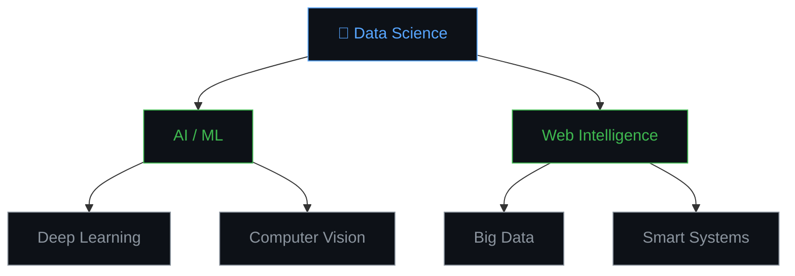

<div align="center">
  <a href="https://yahia-khroufi.github.io/PortfolioWebsite" target="_blank">
    
  </a>
</div>

<div align="center">
  <a href="https://yahia-khroufi.github.io/PortfolioWebsite" target="_blank">
    
  </a>
  &nbsp;
  <a href="https://github.com/yahiakhroufi" target="_blank">
    
  </a>
  &nbsp;
  <a href="https://www.linkedin.com/in/yahia-khroufi" target="_blank">
    
  </a>
  &nbsp;
  <a href="mailto:yahia.khroufi@usmba.ac.ma">
    
  </a>
</div>

<br/>

<div align="center">
  
</div>

---

## 👨‍💻 About Me

<table>
<tr>
<td width="60%" valign="top">

🎓 **Master's Student** in **Web Intelligence & Data Science (WISD)**  
&nbsp;&nbsp;&nbsp;&nbsp;@ **USMBA — Fez, Morocco**

🔬 **Research Focus:** Artificial Intelligence, Machine Learning & Data Science

💡 **Mission:** Bridging academic research with real-world applications to build intelligent, scalable, and impactful solutions

🌍 **Languages:** Arabic · French · English

🤝 Open to **research collaborations**, **internships**, and **professional opportunities**

📍 Based in **Fez, Morocco**

</td>
<td width="40%" align="center" valign="top">



</td>
</tr>
</table>

---

## 🛠️ Tech Stack & Tools

<div align="center">

### 🤖 AI & Machine Learning


### 📊 Data Science & Analytics


### 🌐 Web & Backend


### 🗄️ Databases & Big Data


### ⚙️ DevOps & Tools


</div>

---

## 📊 GitHub Statistics

<div align="center">
  
  
</div>

<div align="center">
  
</div>

<div align="center">
  
</div>

---

## 🚀 Featured Projects

<div align="center">

| Project | Description | Tech Stack | Status |
|:-------:|:-----------:|:----------:|:------:|
| 🔍 **[Project 1](#)** | Brief description of what it does and the problem it solves | `Python` `TensorFlow` `Flask` | ✅ Live |
| 🧬 **[Project 2](#)** | Brief description of what it does and the problem it solves | `React` `FastAPI` `MongoDB` | 🔄 In Progress |
| 📊 **[Project 3](#)** | Brief description of what it does and the problem it solves | `Spark` `Pandas` `Power BI` | ✅ Live |
| 🤖 **[Project 4](#)** | Brief description of what it does and the problem it solves | `PyTorch` `OpenCV` `Docker` | 🔄 In Progress |

</div>

> 💡 *Visit my [Portfolio Website](https://yahia-khroufi.github.io/PortfolioWebsite) for full project details, demos, and write-ups.*

---

## 📚 Research & Publications

```
📄 [Paper Title] — Conference/Journal Name, Year
   ↳ Keywords: AI, Machine Learning, ...
   ↳ DOI / Link: ...

📄 [Paper Title] — Conference/Journal Name, Year
   ↳ Keywords: Data Science, Deep Learning, ...
   ↳ DOI / Link: ...
```

> *Section updated as new work is published.*

---

## 🏆 Achievements & Certifications

<div align="center">

| 🏅 Certification | 🏛️ Issuer | 📅 Year |
|:----------------:|:---------:|:-------:|
| Machine Learning Specialization | Coursera / DeepLearning.AI | 2024 |
| TensorFlow Developer Certificate | Google | 2024 |
| Data Science Professional | IBM | 2023 |

</div>

---

## 📈 Coding Activity

<div align="center">
  
</div>

---

## 🤝 Let's Connect

<div align="center">

I'm always open to interesting conversations, collaboration opportunities, and new ideas.

<a href="https://www.linkedin.com/in/yahia-khroufi" target="_blank">
  
</a>
&nbsp;
<a href="https://yahia-khroufi.github.io/PortfolioWebsite" target="_blank">
  
</a>
&nbsp;
<a href="mailto:yahia.khroufi@usmba.ac.ma">
  
</a>

</div>

---

<div align="center">


<sub>⭐ If you find my work useful, consider starring a repo — it means a lot!</sub>

</div>
