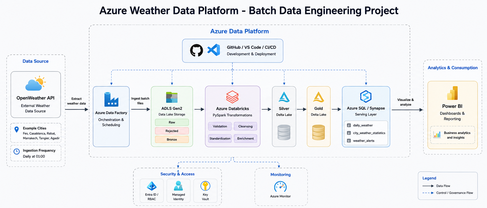

# Yahia Khroufi

### Data Engineering Student | Big Data | Cloud | Real-Time Data Pipelines

I build production-oriented data engineering systems across batch and real-time workloads—from ingestion and ETL/ELT to data lakes, processing, analytical serving, and reporting. My current focus is on cloud, big data, and dependable data platforms.

---

## Featured Data Engineering Projects

### Azure Weather Data Platform

*Batch Data Engineering Project on Microsoft Azure*

An end-to-end Azure batch data engineering platform that ingests weather data from the OpenWeather API, processes it through a Medallion-style architecture, and exposes curated datasets for analytics. It covers scheduled ingestion, validation, cleansing, standardization, enrichment, PySpark transformations, Delta Lake, analytical serving, monitoring, and secure access with Entra ID/RBAC, Managed Identity, and Key Vault.

`OpenWeather API` → `Azure Data Factory` → `ADLS Gen2` → `Azure Databricks` → `Silver Delta Lake` → `Gold Delta Lake` → `Azure SQL / Synapse` → `Power BI`

**Stack:** Azure Data Factory · ADLS Gen2 · Azure Databricks · PySpark · Delta Lake · Azure SQL · Synapse Analytics · Power BI · Azure Monitor · Azure Key Vault · GitHub/VS Code/CI/CD

[View Repository](https://github.com/yahia-khroufi/azure-weather-data-platform) 

---

### IoTFlow

*Real-Time Data Engineering Platform*

IoTFlow is a containerized platform for ingesting, streaming, processing, storing, orchestrating, and visualizing IoT and system metrics—including CPU, RAM, disk, and temperature data. It combines NiFi routing, Kafka streaming, Spark validation and transformations across Raw/Silver/Gold layers, Cassandra storage, Airflow orchestration, and a Streamlit dashboard, with shared Python modules for models, configuration, tests, and utilities.

`IoT / Edge Agent` → `Apache NiFi` → `Apache Kafka` → `Spark Structured Streaming` → `Apache Cassandra` → `Streamlit`  
*Apache Airflow orchestrates workflows and scheduled jobs.*

**Stack:** Python · Docker · Docker Compose · Apache NiFi · Apache Kafka · Apache Spark · Apache Airflow · Apache Cassandra · Streamlit

[View Repository](https://github.com/yahia-khroufi/IoTFlow-Real-Time-Data-Engineering-Platform) · [Watch Demo](https://youtu.be/2abhzypWHvg)

---

## Tech Stack

**Languages**  
  

**Data Engineering**  
   

**Databases**  
  

**Azure / Cloud**  
    

**DevOps & Tools**  
     

**Analytics**  
  

---

## Certifications

- [IBM Data Engineering Professional Certificate](https://www.credly.com/badges/3a44aff6-50d9-40ec-a3b9-28c45a1f6d43/linked_in_profile) 
- [Linux Commands & Shell Scripting Essentials V2](https://www.credly.com/badges/3b92a6c1-6b9b-460a-9c9c-13383fe83da3/linked_in_profile) 
- [Databases and SQL for Data Science](https://www.credly.com/badges/18105e59-dc4f-4cf6-8aff-5e36bb072677/linked_in_profile) 
- [Introduction to Git and GitHub](https://coursera.org/verify/7YPRHLG1ZWC) 
  
---

## Currently Learning

- Microsoft Fabric / DP-700
- Advanced Data Engineering
- Azure Data Engineering

---

## Connect with Me

[LinkedIn](https://www.linkedin.com/in/yahia-khroufi/) · [Email](mailto:yahiakhroufi@gmail.com) · [View My CV](./assets/Yahia-Khroufi-CV.pdf)
-->
